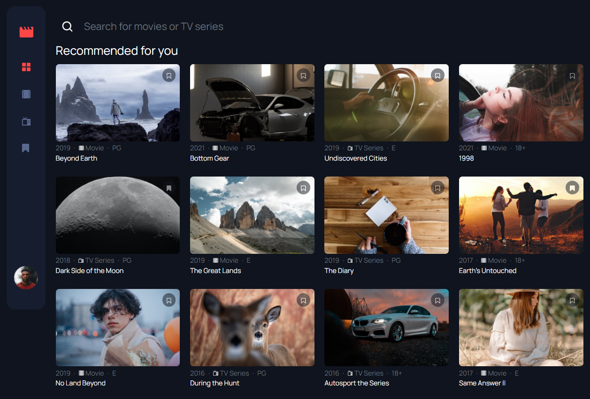

# Frontend Mentor - Entertainment web app solution

This is a solution to the [In-browser markdown editor challenge on Frontend Mentor](https://www.frontendmentor.io/challenges/inbrowser-markdown-editor-r16TrrQX9). Frontend Mentor challenges help you improve your coding skills by building realistic projects.

## Table of contents

- [Overview](#overview)
  - [The challenge](#the-challenge)
  - [Screenshot](#screenshot)
  - [Links](#links)
- [My process](#my-process)
  - [Built with](#built-with)
  - [Continued development](#continued-development)
  - [Useful resources](#useful-resources)
- [Author](#author)

## Overview

### The challenge

Users should be able to:

- View the optimal layout for the app depending on their device's screen size
- See hover states for all interactive elements on the page
- Navigate between Home, Movies, TV Series, and Bookmarked Shows pages
- Add/Remove bookmarks from all movies and TV series
- Search for relevant shows on all pages
- **Bonus**: Build this project as a full-stack application
- **Bonus**: If you're building a full-stack app, we provide authentication screen (sign-up/login) designs if you'd like to create an auth flow

### Screenshot

## Run Project Locally

In the project directory, you can run:

### `npm install`

to download dependencies.

### `npm run start`

Runs the app in the development mode.\
Open [http://localhost:3000](http://localhost:3000) to view it in your browser.

### Links

- Solution URL: [https://github.com/mvrquix/entertainment-app](https://github.com/mvrquix/entertainment-app)
- Live Site URL: [https://isaqc-entertainment.web.app/](https://isaqc-entertainment.web.app)

## My process

### Built with

- [Bootstrap](https://getbootstrap.com/docs/5.0/getting-started/introduction)
- Desktop-first workflow
- [React](https://reactjs.org/) - JS library

### Continued development

The next step to this project would be to create a server application to persist data with endpoints for the frontend to network with. With that in place
it would make sense to centralize state management on the frontend in a redux store.

## Author

- Website - [Marquis Morrow](https://isaqc.io/)
- Frontend Mentor - [@mvrquix](https://www.frontendmentor.io/profile/mvrquix)
- Linkedin - [@marquismorrow](https://www.linkedin.com/in/marquismorrow/)
